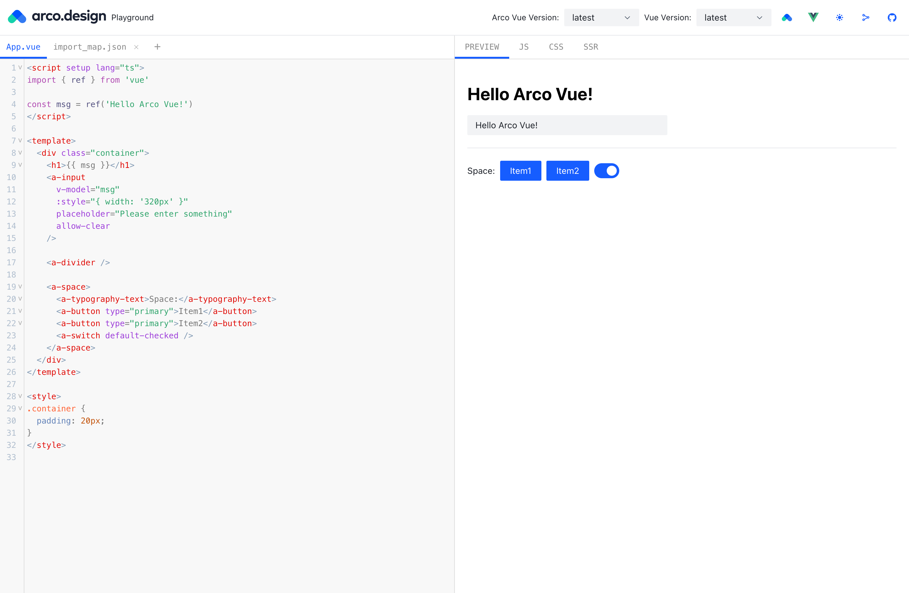

# Arco Vue playground



🥳 [look here](https://arco-vue-playground.vercel.app)

!only chinese network **服务和资源均在国外(免费的)，国内网络预计延迟2~3s(仅首次加载)，请等待一下🤪**

## supports

- vue3
- options and setup api
- typescript
- auto import arco and arco-icon
- code prettier
- defineModel
- reactivityTransform

> ‼️ arco-vue version support >= 2.28.0

tip: repl support prettier code use keyboard [mac] `Control + Shift + f`, [win] `Ctrl + Shift + f`

## run

with [bun](https://bun.sh/)

```cmd
bun i
bun dev

# or
bun preview
```

## project

- [vue3](https://staging-cn.vuejs.org/)
- [arco-design](https://arco.design/)

## thx 🥰

- [@vue/repl](https://github.com/vuejs/repl)
- [vue-use](https://github.com/vueuse/vueuse)
- [element-plus-playground](https://github.com/element-plus/element-plus-playground)
